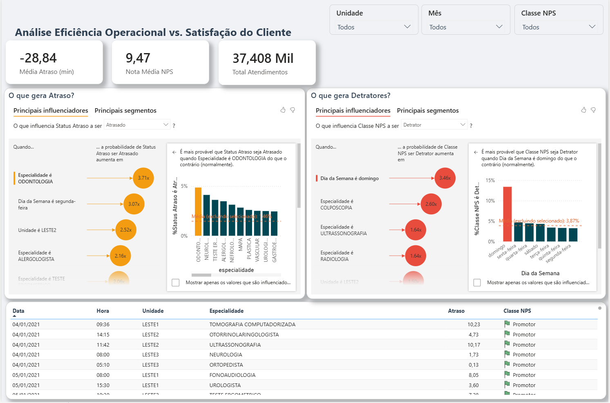
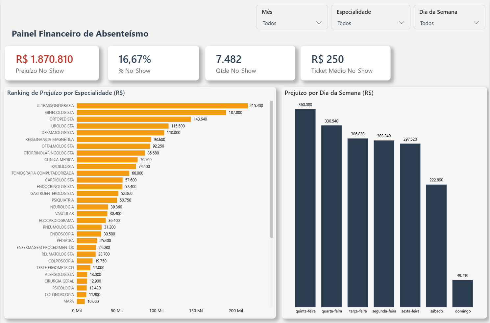

# 🏥📉 Jornada do Paciente e Impacto Financeiro (No-Show)

## 📋 Sobre o Projeto
Este projeto analisa a eficiência operacional e a qualidade do atendimento de clínicas de saúde. O objetivo principal é identificar gargalos na jornada do paciente (atrasos, satisfação via NPS) e quantificar o impacto financeiro do absenteísmo (No-Show).

**Principais Perguntas de Negócio Respondidas:**
1. Qual o valor financeiro perdido por pacientes que agendam e não comparecem?
2. Existe correlação entre o tempo de espera e a nota do NPS (Net Promoter Score)?
3. Quais especialidades possuem maior taxa de No-Show?
4. Qual o perfil dos pacientes Detratores, Neutros e Promotores?

## 📊 Dashboard Interativo

## 📜 Prints das telas do Dashboard

## 🔗 Link do Dashboard Interativo
([Demo Dashboard Performance e Jornada do Paciente](https://youtu.be/G8m1W-WBSrY))

## 🛠️ Tecnologias Utilizadas
* **Python (Pandas/Numpy):** Enriquecimento de dados, precificação automática e simulação de cenários.
* **Excel:** Fonte de dados bruta.
* **Power Query (ETL):** Tratamento de dados temporais e categorização.
* **Power BI:** Visualização de dados e storytelling.

## ⚙️ Etapas do Pipeline
### 1. Engenharia de Dados (Python)
Utilização de script Python para enriquecer a base bruta que não continha valores financeiros.
* **Mapeamento de Preços:** Criação de um dicionário (`dict`) para atribuir valores específicos a mais de 40 procedimentos/especialidades.
* **Simulação de No-Show:** Geração de massa de dados sintética (20% da base) para simular o cenário de não comparecimento, permitindo a análise de Perda de Receita.

### 2. Transformação de Dados (Power Query / M)
Após o processamento em Python, os dados foram refinados no Power BI:
* **Cálculo de Atraso:** Diferença entre agendamentos e atendimentos.
* **Classificação NPS:** Criação da coluna condicional seguindo a metodologia oficial:
    * *Detrator:* Notas 0 a 6
    * *Neutro:* Notas 7 e 8
    * *Promotor:* Notas 9 e 10
* **Colunas Temporais:** Extração de Dia da Semana, Hora e Mês para análise de sazonalidade.

### 3. Visualização (KPIs)
* **No-Show Rate (%):** Percentual de ausência.
* **Perda Financeira:** Soma do `Valor_Consulta` onde `Status = 'No-Show'`.
* **NPS Score:** `(% Promotores) - (% Detratores)`.
* **Tempo Médio de Espera:** Análise por especialidade.
  
---
*Desenvolvido por Andressa*
